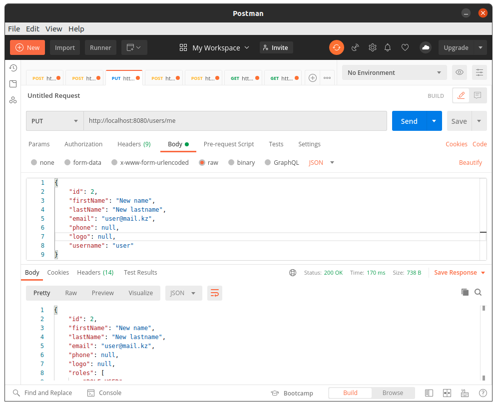
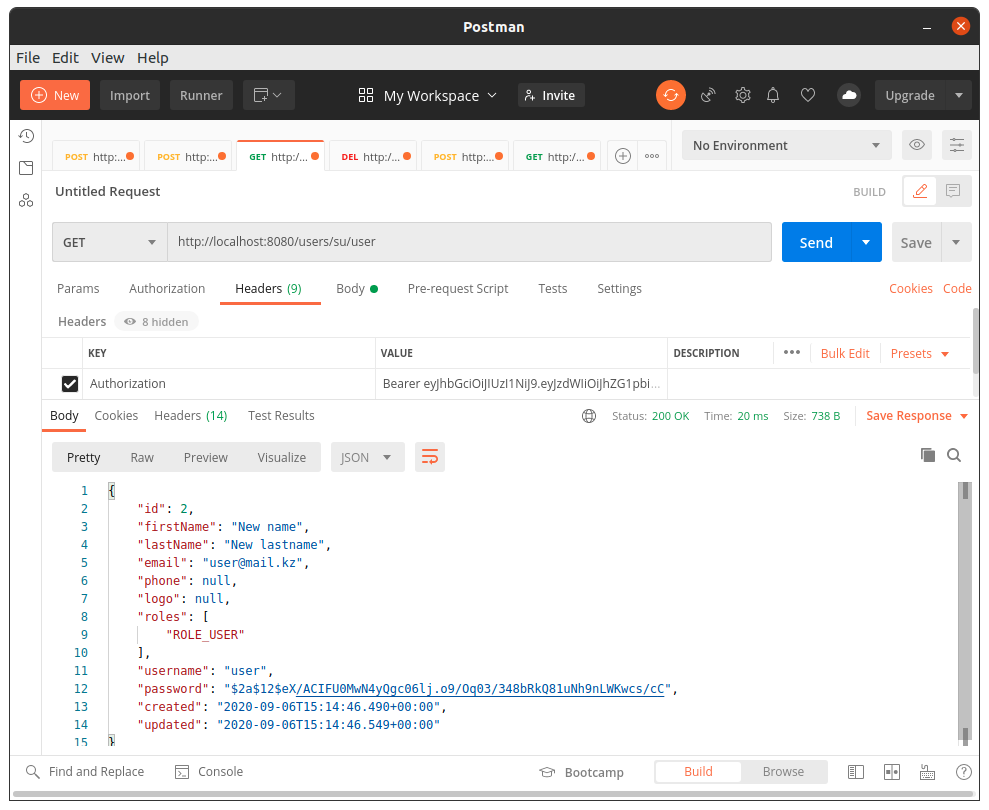

## DEMO: RESTful API с аутентификацией пользователя на Java/Spring Framework/JWT/JPA/PostgreSQL/+CORS) ##

#### Цель проекта: создание многопользовательского сервиса по управлению списками задач.

Для пользователей определены следующие роли:
* **ROLE_USER** - Обычный пользователь
* **ROLE_ADMIN** - Администратор

Реализованы функции по ролям:

*Для всех:*
* Регистрация пользователя (логин, почта, пароль)
* Аутентификация (логин, пароль) и генерации токена JWT
* Запрос своего профиля
* Обновление своего профиля
* Запрос 4-х значного кода для сброса своего пароля (код отправляется на зарегистрированную почту пользователя)
* Сброс своего пароля (по 4-х значному коду)


* Запрос своего списка задач
* Регистрация новой своей задачи
* Обновление своей задачи (по id)
* Изменение статуса своей задачи (по id)
* Удаление своей задачи (по id)

*Для роли Администратора:*
* Запрос списка всех пользователей
* Запрос профиля конкретного пользователя (по логину)
* Удаление конкретного пользователя (по логину)


* Запрос списка всех задач
* Запрос порционного списка всех задач (с поддержкой пагинации)
* Запрос конкретной задачи любого пользователя (по id)
* Регистрация новой задачи для определенного пользователя
* Обновление конкретной задачи любого пользователя (по id)
* Изменение статуса конкретной задачи любого пользователя (по id)
* Удаление конкретной задачи любого пользователя (по id)
-----------------------------------

**Структура объекта User**
```
User {  
    id	        long    
    firstName	string  
    lastName	string  
    email	string  
    phone	string  
    logo	string  
    roles	
        [string Enum:   
            [ ROLE_ADMIN, ROLE_USER ]   
        ]   
    username	string  
    password	string  
    created	date-time   
    updated	date-time   
}
```
**Структура объекта Task**
```
Task {
    id	            long
    name            string
    description     string
    startDateTime   date-time
    endDateTime     date-time
    files           [string]
    status          byte
    userId          long
    created         date-time
    updated         date-time
}
```
-----------------------------------

**Используемые API**


 

-----------------------------------

**Настройки проекта**

Файл application.yml
```
app:
  velocity:
    templates:
      location: /templates/
spring:
  datasource: 
    # данные подключения к бд
    url: jdbc:postgresql://localhost/waviot_tasks
    username: postgres
    password: postgres
  jpa:
    hibernate:
      ddl-auto: update
    properties:
      hibernate:
        dialect: org.hibernate.dialect.PostgreSQLDialect
        format_sql: true
        show_sql: false
        id:
          new_generator_mappings: false
server:
   # порт приложения
   port: 8080

security:
  jwt:
    token:
      secret-key: secret-key
      # время действия токена, указан 1 час
      expire-length: 3600000
```

Файл mail.properties (для отправки письма с кодом сброса пароля)
```
spring.mail.default-encoding=UTF-8

# почтовый smtp сервер
spring.mail.host=

# имя пользователя
spring.mail.username=

# пароль пользователя
spring.mail.password=

spring.mail.port=25
spring.mail.protocol=smtp
spring.mail.debug=false
spring.mail.smtp.auth=true
spring.mail.smtp.starttls.enable=false
```

-----------------------------------

**Скриншоты работы**

Все API кроме регистрации и аутентификации не доступны без валидного токена 
 

*Для роли пользователь:*

Регистрация пользователя (логин, почта, пароль) 
 

Аутентификация (логин, пароль) и генерации токена JWT   
 

Запрос своего профиля   
 

Обновление своего профиля   
 

Запрос 4-х значного кода для сброса своего пароля   
 

Код отправляется на зарегистрированную почту пользователя   
 

Сброс своего пароля (по 4-х значному коду)  
 

Запрос своего списка задач  
 

Регистрация новой своей задачи  
 

Обновление своей задачи (по id) 
 

Изменение статуса своей задачи (по id)  
 

Удаление своей задачи (по id)   
 


*Для роли Администратора:*

Запрос списка всех пользователей    
 

Запрос профиля конкретного пользователя (по логину) 
 

Удаление конкретного пользователя (по логину)    
 

Запрос списка всех задач    
 

Запрос порционного списка всех задач (с поддержкой пагинации)   
 

Запрос конкретной задачи любого пользователя (по id)    
 

Регистрация новой задачи для определенного пользователя 
 

Обновление конкретной задачи любого пользователя (по id)    
 

Изменение статуса конкретной задачи любого пользователя (по id) 
 

Удаление конкретной задачи любого пользователя (по id)  
 